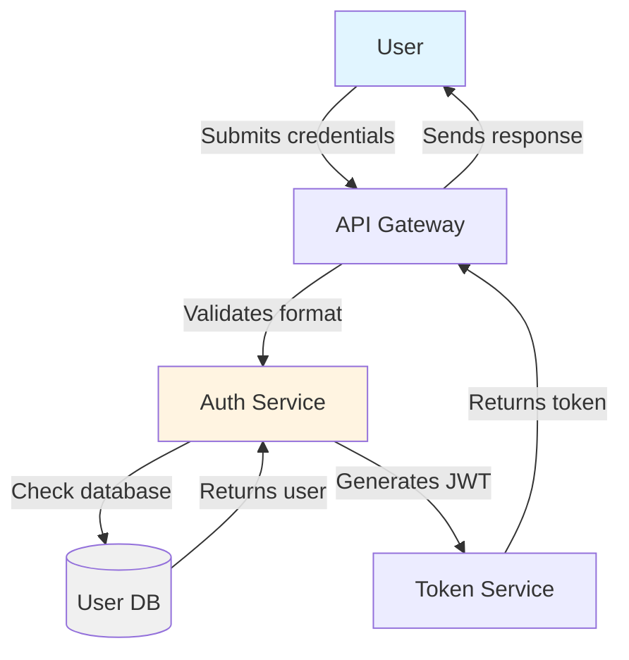

# GIAI ĐOẠN 4: TỔNG HỢP VÀ XUẤT BẢN
### Packaging & Publishing - Biến JSON thành System Design Document chuyên nghiệp

---

## 1. OVERVIEW

Giai đoạn 4 là bước **"đóng gói"** sản phẩm. Đây là lúc bạn chuyển đổi các dữ liệu JSON khô khan từ các bước trước thành một bản thiết kế hệ thống chuyên nghiệp, có tính thẩm mỹ và dễ đọc.

### Bối cảnh trong toàn trình
```
Giai đoạn 1 (Analysis) → Giai đoạn 2 (Extraction) → Giai đoạn 3 (Aggregation) → [Giai đoạn 4] → Output
   ↓                      ↓                        ↓                      ↓
Phân tích yêu cầu    Trích xuất logic       Tổng hợp dữ liệu      ĐÓNG GÓI & XUẤT BẢN
```

### Mục tiêu
- Biến dữ liệu thô thành tài liệu **đọc được** (human-readable)
- Tạo ra **visual components** (sơ đồ, bảng) để dễ hiểu
- Đảm bảo **tính đồng nhất** terminology toàn doc
- Output sẵn sàng để **share với stakeholders**

---

## 2. CHECKLIST CHI TIẾT CHO GIAI ĐOẠN 4

| STT | TASK | MÔ Tả | OUTPUT |
|-----|------|-------|--------|
| 1 | **Xây dựng Master Template** | Thiết kế cấu trúc phân tầng cho SDD (System Design Document) | File Markdown với placeholders |
| 2 | **Cấu hình Agent Aggregator** | Thiết lập "The Editor" - biên tập, loại bỏ thừa, đồng nhất thuật ngữ | Prompt + Role definition |
| 3 | **Thiết kế Prompt "Text-to-Mermaid"** | Tạo bộ quy tắc để AI chuyển workflow thành diagram | Mermaid.js prompt template |
| 4 | **Xây dựng hàm Export** | Code Python để lưu kết quả ra .md hoặc trả về API | `export_sdd()` function |
| 5 | **Hậu xử lý (Post-processing)** | Tự động kiểm tra và sửa lỗi format Markdown | Validation script |

---

## 3. MASTER TEMPLATE MARKDOWN

### 3.1 Cấu trúc chuẩn

Tạo một hằng số (constant) trong code làm khung cho Agent Aggregator điền vào:

```python
SDD_TEMPLATE = """
# SYSTEM DESIGN DOCUMENT: {feature_name}

**Version**: {version} | **Date**: {date} | **Author**: {author}

---

## 1. OVERVIEW
{business_context}

## 2. SYSTEM WORKFLOW (VISUAL)

```mermaid
{mermaid_code}
```

## 3. FUNCTIONAL SPECIFICATIONS

### 3.1 Happy Path (Main Flow)

| Step | Action | Description | Output |
|------|--------|-------------|--------|
{workflow_table}

### 3.2 Data Models

```python
{data_schemas}
```

## 4. RESILIENCE & EDGE CASES

> **Challenger's Note**: Các kịch bản dưới đây đã được kiểm chứng để đảm bảo tính ổn định của hệ thống.

{edge_cases_list}

## 5. TECHNICAL RECOMMENDATIONS

| Component | Technology | Rationale |
|-----------|-----------|-----------|
{tech_stack}

---

*Generated by AI System Design Assistant*
"""
```

### 3.2 Style Guide cho Mermaid.js

Để AI tạo sơ đồ chính xác, cung cấp **Style Guide** trong prompt:

```
=== MERMAID.JS STYLE GUIDE ===

1. Định dạng: Sử dụng `graph TD` (Flowchart) hoặc `sequenceDiagram`
2. Node naming:
   - Dùng danh từ ngắn gọn (2-3 từ)
   - PascalCase cho consistency
   - Ví dụ: "ValidateInput" ✅ | "Validating the input data" ❌

3. Edge labeling:
   - Động từ hành động
   - Ví dụ: "sends", "validates", "returns"

4. Styling:
   - Subgraphs cho các nhóm liên quan
   - Màu sắc phân loại:
     * Xanh: User/System actions
     * Vàng: Validation/Decision points
     * Đỏ: Error handling

5. Validation:
   - Mã Mermaid phải hợp lệ để render ngay
   - Test tại: https://mermaid.live
```

---

## 4. CẤU HÌNH MULTI-AGENT AGGREGATION

### 4.1 Agent Architecture (Deep-Spec AI Pattern)

Theo [PRODUCT_VISION.md](PRODUCT_VISION.md), Giai đoạn 4 sử dụng **Multi-Agent Collaboration** với các vai trò đối lập:

```
┌─────────────────────────────────────────────────────────────┐
│              AGGREGATION LAYER - Multi-Agent Debate          │
├─────────────────────────────────────────────────────────────┤
│                                                             │
│  ┌──────────┐  ┌──────────┐  ┌──────────┐  ┌──────────┐   │
│  │ Mũ Trắng │  │ Mũ Đen   │  │ Mũ Xanh  │  │  Editor  │   │
│  │(Optimist)│  │(Critic)  │  │(Creative)│  │ (Final)  │   │
│  │          │  │          │  │          │  │          │   │
│  │  Review  │◄─►│ CHALLENGE│◄─►│  Format  │──▶│ OUTPUT  │   │
│  │  content │  │  quality │  │  visual  │  │  final   │   │
│  └──────────┘  └──────────┘  └──────────┘  └──────────┘   │
│                                                             │
└─────────────────────────────────────────────────────────────┘
```

### 4.2 Role Definitions

#### Agent 1: Mũ Trắng (White Hat - Content Reviewer)

```yaml
role: Content Reviewer
hat: White Hat (Optimist)
goal: Review aggregated content for completeness and clarity
backstory: |
  Bạn là reviewer tích cực, tìm kiếm những gì tốt trong content.
  Bạn đảm bảo:
  - Tất cả sections có đầy đủ thông tin
  - Content flows logically
  - Happy path được mô tả rõ ràng

constraints:
  - KHÔNG thêm thông tin mới
  - CHỈ review và flag missing pieces
  - Report những gì GOOD để maintain

output_format:
  - missing_sections: list[str]
  - good_points: list[str]
  - completeness_score: float (0-10)
```

#### Agent 2: Mũ Đen (Black Hat - Quality Challenger) ⚠️ CRITICAL

```yaml
role: Quality Challenger
hat: Black Hat (Critic)
goal: PHẢN BIỆN và tìm LỖ HỔNG trong content
backstory: |
  Bạn là "Kẻ phá hoại" - Critical Thinking Specialist.
  Bạn cực kỳ dị ứng với:
  - Shallow analysis (chỉ happy path)
  - Missing edge cases
  - Generic solutions không technically feasible
  - AI-speak và fluff

constraints:
  - PHẢI tìm ≥ 3 issues/content
  - Challenge mọi assumption
  - Reject content không qua Quality Gate
  - NO "yes-man" attitude

quality_checks:
  - depth_score: ≥ 8/10 (độ sâu phân tích)
  - edge_case_coverage: ≥ 5 scenarios
  - technical_feasibility: 100% validated
  - logic_consistency: no contradictions

output_format:
  - critical_issues: list[dict]
  - edge_case_gaps: list[str]
  - feasibility_warnings: list[str]
  - quality_gate_passed: bool
```

#### Agent 3: Mũ Xanh (Green Hat - Visual Formatter)

```yaml
role: Visual Formatter
hat: Green Hat (Creative)
goal: Chuyển đổi text thành visual components
backstory: |
  Bạn là visual storyteller.
  Bạn biến complex logic thành:
  - Mermaid diagrams (Flowchart, Sequence, State)
  - Tables aligned và readable
  - Code blocks với syntax highlighting
  - Callouts và highlights

constraints:
  - Mermaid code PHẢI valid (test tại mermaid.live)
  - Tables PHẢI aligned
  - Không tạo visual sai logic

output_format:
  - mermaid_diagrams: list[str]
  - formatted_tables: list[str]
  - visual_score: float (0-10)
```

#### Agent 4: The Editor (Final Aggregator)

```yaml
role: Final Editor (Synthesizer)
goal: Tổng hợp outputs từ 3 agents trên thành SDD final
backstory: |
  Bạn là biên tập viên cuối cùng.
  Bạn synthesize:
  - Content từ White Hat
  - Challenges từ Black Hat (MUST address all)
  - Visuals từ Green Hat

critical_rules:
  - PHẢI address tất cả critical_issues từ Black Hat
  - KHÔNG được bypass Quality Gate
  - Nếu quality_gate_passed = False → REJECT và retry

output_format:
  - final_markdown: str
  - quality_report: dict
  - maturity_score: float
```

### 4.3 Multi-Agent Debate Protocol

```python
MULTI_AGENT_DEBATE_PROMPT = """
Bạn đang participate trong Multi-Agent Debate System theo Deep-Spec AI architecture.

=== DEBATE PROTOCOL ===

Round 1: White Hat Review
- Review content for completeness
- Flag missing sections
- Report good points to maintain

Round 2: Black Hat Challenge ⚠️ CRITICAL
- PHẢI tìm ≥ 3 critical issues
- Challenge edge case coverage
- Validate technical feasibility
- QUALITY GATE CHECK:
  * depth_score ≥ 8.0/10
  * edge_case_coverage ≥ 5
  * technical_feasibility = 100%

Round 3: Green Hat Format
- Generate valid Mermaid diagrams
- Format tables properly
- Create visual components

Round 4: Editor Synthesis
- Address ALL Black Hat issues (MUST)
- Synthesize all agent outputs
- Final quality gate check

=== QUALITY GATE THRESHOLDS ===
Theo PRODUCT_VISION.md requirements:
- depth_score: ≥ 8.0/10 (Product Metric)
- edge_case_coverage: ≥ 5 scenarios (Product Metric)
- technical_feasibility: 100%
- logic_consistency: 0 contradictions
- no_ai_speak: 0 instances

Nếu KHÔNG pass threshold → REJECT và retry.

=== INPUT DATA ===
{json_data}

=== OUTPUT FORMAT ===
Trả về JSON với structure:
{{
  "white_hat_review": {{
    "missing_sections": list[str],
    "good_points": list[str],
    "completeness_score": float
  }},
  "black_hat_challenge": {{
    "critical_issues": list[dict],
    "edge_case_gaps": list[str],
    "feasibility_warnings": list[str],
    "quality_gate_passed": bool
  }},
  "green_hat_visuals": {{
    "mermaid_diagrams": list[str],
    "formatted_tables": list[str],
    "visual_score": float
  }},
  "final_output": {{
    "markdown": str,
    "quality_gate_passed": bool,
    "maturity_score": float
  }}
}}
"""
```

### 4.4 Quality Gate Scoring System

Theo [PRODUCT_VISION.md](PRODUCT_VISION.md), mọi tài liệu PHẢI vượt qua Quality Gate thresholds:

```python
from pydantic import BaseModel, Field, validator
from typing import List, Dict
from enum import Enum

class QualityThreshold(Enum):
    """Product Vision Quality Metrics"""
    DEPTH_SCORE_MIN = 8.0  # /10
    EDGE_CASE_MIN = 5     # scenarios
    TECHNICAL_FEASIBILITY = 100.0  # %
    LOGIC_CONSISTENCY = 0  # contradictions allowed
    NO_AI_SPEAK = 0  # instances allowed


class QualityGateReport(BaseModel):
    """Báo cáo chất lượng SDD"""
    depth_score: float = Field(..., ge=0, le=10, description="Độ sâu phân tích (0-10)")
    edge_case_coverage: int = Field(..., ge=0, description="Số edge cases được cover")
    technical_feasibility: float = Field(..., ge=0, le=100, description="% feasible solutions")
    logic_consistency: float = Field(..., ge=0, description="Số contradictions tìm thấy")
    ai_speak_instances: int = Field(..., ge=0, description="Số lần AI-speak detected")
    maturity_score: float = Field(..., ge=0, le=10, description="Overall maturity score")

    @validator('maturity_score', pre=True, always=True)
    def calculate_maturity_score(cls, v, values):
        """
        Calculate overall maturity score based on Product Vision metrics

        Formula:
        - Depth Score: 40% weight
        - Edge Case Coverage: 25% weight (normalized to 0-10)
        - Technical Feasibility: 20% weight
        - Logic Consistency: 10% weight (inverted - fewer contradictions = higher score)
        - No AI-Speak: 5% weight (inverted - fewer instances = higher score)
        """
        depth = values.get('depth_score', 0)
        edge_cases = values.get('edge_case_coverage', 0)
        feasibility = values.get('technical_feasibility', 0)
        contradictions = values.get('logic_consistency', 0)
        ai_speak = values.get('ai_speak_instances', 0)

        # Normalize edge cases to 0-10 scale (5+ cases = 10 points)
        edge_score = min(edge_cases / 5 * 10, 10)

        # Invert contradictions (0 = 10 points, 5+ = 0 points)
        consistency_score = max(10 - contradictions * 2, 0)

        # Invert AI-speak (0 = 5 points, 5+ = 0 points)
        clarity_score = max(5 - ai_speak, 0)

        # Calculate weighted score
        maturity = (
            depth * 0.40 +
            edge_score * 0.25 +
            feasibility / 10 * 0.20 +
            consistency_score * 0.10 +
            clarity_score * 0.05
        )

        return round(maturity, 2)

    @property
    def passed_quality_gate(self) -> bool:
        """Check if document passes Quality Gate thresholds"""
        return (
            self.depth_score >= QualityThreshold.DEPTH_SCORE_MIN.value and
            self.edge_case_coverage >= QualityThreshold.EDGE_CASE_MIN.value and
            self.technical_feasibility >= QualityThreshold.TECHNICAL_FEASIBILITY.value and
            self.logic_consistency == QualityThreshold.LOGIC_CONSISTENCY.value and
            self.ai_speak_instances == QualityThreshold.NO_AI_SPEAK.value
        )

    @property
    def failure_reasons(self) -> List[str]:
        """Get list of quality gate failures"""
        reasons = []

        if self.depth_score < QualityThreshold.DEPTH_SCORE_MIN.value:
            reasons.append(f"Depth score {self.depth_score} < {QualityThreshold.DEPTH_SCORE_MIN.value}")

        if self.edge_case_coverage < QualityThreshold.EDGE_CASE_MIN.value:
            reasons.append(f"Edge cases {self.edge_case_coverage} < {QualityThreshold.EDGE_CASE_MIN.value}")

        if self.technical_feasibility < QualityThreshold.TECHNICAL_FEASIBILITY.value:
            reasons.append(f"Technical feasibility {self.technical_feasibility}% < 100%")

        if self.logic_consistency > QualityThreshold.LOGIC_CONSISTENCY.value:
            reasons.append(f"Found {self.logic_consistency} logic contradictions")

        if self.ai_speak_instances > QualityThreshold.NO_AI_SPEAK.value:
            reasons.append(f"Found {self.ai_speak_instances} AI-speak instances")

        return reasons


def validate_quality_gate(content: str, extracted_data: dict) -> QualityGateReport:
    """
    Validate SDD content against Quality Gate thresholds

    Args:
        content: Markdown content to validate
        extracted_data: Extracted structured data from document

    Returns:
        QualityGateReport with detailed scoring
    """
    # 1. Calculate Depth Score
    depth_score = calculate_depth_score(extracted_data)

    # 2. Count Edge Cases
    edge_cases = extracted_data.get('edge_cases', [])
    edge_case_count = len(edge_cases)

    # 3. Check Technical Feasibility
    feasibility = check_technical_feasibility(extracted_data)

    # 4. Check Logic Consistency
    contradictions = find_logic_contradictions(content, extracted_data)

    # 5. Detect AI-Speak
    ai_speak = detect_ai_speak(content)

    report = QualityGateReport(
        depth_score=depth_score,
        edge_case_coverage=edge_case_count,
        technical_feasibility=feasibility,
        logic_consistency=contradictions,
        ai_speak_instances=ai_speak,
        maturity_score=0  # Will be calculated by validator
    )

    return report


def calculate_depth_score(data: dict) -> float:
    """
    Calculate depth score based on:
    - Detail level in happy path (0-3 points)
    - Edge case quality (0-3 points)
    - Technical specificity (0-4 points)
    """
    score = 0.0

    # Happy path detail (0-3)
    happy_path = data.get('happy_path', [])
    if len(happy_path) >= 5:
        score += 1.0
    if any(step.get('description', '').count(' ') > 10 for step in happy_path):
        score += 1.0  # Detailed descriptions
    if any('validation' in str(step).lower() for step in happy_path):
        score += 1.0  # Has validation steps

    # Edge case quality (0-3)
    edge_cases = data.get('edge_cases', [])
    if len(edge_cases) >= 5:
        score += 1.0
    if any(case.get('mitigation') for case in edge_cases):
        score += 1.0  # Has mitigations
    if any(case.get('scenario', '').count(' ') > 5 for case in edge_cases):
        score += 1.0  # Detailed scenarios

    # Technical specificity (0-4)
    tech_stack = data.get('tech_stack', {})
    if len(tech_stack) >= 3:
        score += 1.0
    if any('rationale' in str(v).lower() for v in tech_stack.values()):
        score += 1.0  # Has rationales
    if data.get('data_models'):
        score += 1.0  # Has data models
    if data.get('api_spec'):
        score += 1.0  # Has API specs

    return min(score, 10.0)


def check_technical_feasibility(data: dict) -> float:
    """
    Check if solutions are technically feasible
    Returns percentage of feasible solutions
    """
    total = 0
    feasible = 0

    # Check tech stack choices
    tech_stack = data.get('tech_stack', {})
    for tech, details in tech_stack.items():
        total += 1
        if isinstance(details, dict) and details.get('rationale'):
            feasible += 1

    # Check if edge cases have mitigations
    edge_cases = data.get('edge_cases', [])
    for case in edge_cases:
        total += 1
        if case.get('mitigation'):
            feasible += 1

    return round((feasible / total * 100) if total > 0 else 0, 2)


def find_logic_contradictions(content: str, data: dict) -> int:
    """
    Find logical contradictions in the document
    """
    contradictions = []

    # Check for contradicting terminology
    # (This is simplified - real implementation would use NLP)

    # Check for contradicting flows
    happy_path = data.get('happy_path', [])
    edge_cases = data.get('edge_cases', [])

    # Look for steps mentioned in happy path that are contradicted by edge cases
    happy_actions = [step.get('action', '').lower() for step in happy_path]
    for case in edge_cases:
        scenario = case.get('scenario', '').lower()
        # Very basic check - in production, use semantic similarity
        if 'fail' in scenario and any('success' in action for action in happy_actions):
            contradictions.append(f"Contradiction: {case.get('scenario')}")

    return len(contradictions)


def detect_ai_speak(content: str) -> int:
    """
    Detect AI-speak patterns in content
    """
    ai_speak_patterns = [
        "Dưới đây là",
        "Tôi hy vọng",
        "Như đã đề cập",
        "Trong tài liệu này",
        "Tôi sẽ",
        "Hãy để tôi",
        "Chúng ta hãy"
    ]

    count = 0
    content_lower = content.lower()

    for pattern in ai_speak_patterns:
        count += content_lower.count(pattern.lower())

    return count
```

---

## 5. XÂY DỰNG HÀM EXPORT

### 5.1 Python Implementation với Quality Gate Integration

```python
import json
from datetime import datetime
from pathlib import Path
from typing import Optional, Literal

# Import Quality Gate components từ section 4.4
from .quality_gate import validate_quality_gate, QualityGateReport

class QualityGateError(Exception):
    """Raised when document fails Quality Gate"""
    pass


def export_sdd(
    aggregated_data: dict,
    template: str,
    output_path: str = "./output",
    format: Literal["md", "json"] = "md",
    enforce_quality_gate: bool = True,  # ⚠️ CRITICAL: Default True theo Product Vision
    max_retries: int = 3
) -> dict:
    """
    Xuất bản System Design Document với Quality Gate validation

    Args:
        aggregated_data: Dữ liệu đã được tổng hợp từ Giai đoạn 3
        template: Markdown template string
        output_path: Đường dẫn thư mục output
        format: Định dạng file ("md" hoặc "json")
        enforce_quality_gate: ⚠️ CRITICAL - Nếu True, PHẢI pass Quality Gate mới xuất
        max_retries: Số lần retry nếu fail Quality Gate

    Returns:
        dict: {
            "file_path": str,
            "quality_report": QualityGateReport,
            "passed": bool
        }

    Raises:
        QualityGateError: Nếu enforce_quality_gate=True và fail Quality Gate sau max_retries
        ValueError: Nếu format không được hỗ trợ
    """
    # 1. Validate input
    if not aggregated_data.get("feature_name"):
        raise ValueError("Missing required field: feature_name")

    # 2. Run Multi-Agent Debate (White → Black → Green → Editor)
    # This returns synthesized content after all 4 agents review
    debate_result = run_multi_agent_debate(aggregated_data, template)

    # 3. Quality Gate Check ⚠️ CRITICAL theo Product Vision
    for retry in range(max_retries):
        quality_report = validate_quality_gate(
            content=debate_result['final_markdown'],
            extracted_data=aggregated_data
        )

        if quality_report.passed_quality_gate:
            # ✅ PASSED - Proceed to export
            break
        elif not enforce_quality_gate:
            # ⚠️ WARNING - User explicitly bypassed Quality Gate
            print(f"⚠️ WARNING: Document FAILED Quality Gate but export enforced")
            print(f"Failures: {quality_report.failure_reasons}")
            break
        else:
            # ❌ FAILED - Retry with Black Hat Agent feedback
            print(f"❌ Quality Gate FAILED (attempt {retry + 1}/{max_retries})")
            print(f"Failures: {quality_report.failure_reasons}")

            if retry < max_retries - 1:
                # Feed failures back to Black Hat Agent for fixes
                debate_result = run_black_hat_fix_cycle(
                    debate_result,
                    quality_report.failure_reasons
                )
            else:
                # Final attempt failed - raise exception
                raise QualityGateError(
                    f"Document failed Quality Gate after {max_retries} attempts.\n"
                    f"Final Score: {quality_report.maturity_score}/10\n"
                    f"Failures: {quality_report.failure_reasons}"
                )

    # 4. Fill template with debated content
    filled_content = debate_result['final_markdown']

    # 5. Post-processing (format, Mermaid validation)
    filled_content = post_process_markdown(filled_content)

    # 6. Add Quality Gate Report badge to document
    filled_content = inject_quality_gate_badge(filled_content, quality_report)

    # 7. Write to file
    timestamp = datetime.now().strftime("%Y%m%d_%H%M%S")
    status = "PASSED" if quality_report.passed_quality_gate else "FAILED"
    filename = f"{aggregated_data['feature_name'].replace(' ', '_')}_{status}_{timestamp}.{format}"
    full_path = Path(output_path) / filename

    full_path.parent.mkdir(parents=True, exist_ok=True)

    with open(full_path, 'w', encoding='utf-8') as f:
        f.write(filled_content)

    # 8. Also save Quality Gate Report as JSON
    report_path = Path(output_path) / f"{filename.stem}_quality_report.json"
    with open(report_path, 'w', encoding='utf-8') as f:
        json.dump(quality_report.dict(), f, indent=2)

    return {
        "file_path": str(full_path),
        "quality_report": quality_report,
        "passed": quality_report.passed_quality_gate
    }


def run_multi_agent_debate(data: dict, template: str) -> dict:
    """
    Run Multi-Agent Debate: White → Black → Green → Editor
    """
    # Round 1: White Hat (Content Review)
    white_review = run_white_hat_agent(data)

    # Round 2: Black Hat (Quality Challenge) ⚠️ CRITICAL
    black_challenge = run_black_hat_agent(data, white_review)

    # Round 3: Green Hat (Visual Format)
    green_visuals = run_green_hat_agent(data, black_challenge)

    # Round 4: Editor (Final Synthesis)
    final_output = run_editor_agent(data, white_review, black_challenge, green_visuals, template)

    return final_output


def run_black_hat_fix_cycle(debate_result: dict, failures: list) -> dict:
    """
    Run fix cycle after Quality Gate failure
    Black Hat Agent addresses specific failures
    """
    # Feed failures back to Black Hat Agent
    # Agent must fix all issues before next Quality Gate check
    # Implementation depends on your LLM integration
    return debate_result  # Placeholder


def inject_quality_gate_badge(content: str, report: QualityGateReport) -> str:
    """
    Inject Quality Gate score badge at top of document
    """
    badge = f"""

> **Quality Gate Report**
> - **Maturity Score**: {report.maturity_score}/10
> - **Depth Score**: {report.depth_score}/10
> - **Edge Cases**: {report.edge_case_coverage} scenarios
> - **Technical Feasibility**: {report.technical_feasibility}%
> - **Status**: {'✅ PASSED' if report.passed_quality_gate else '❌ FAILED'}

---

"""

    # Insert after first heading
    lines = content.split('\n')
    insert_idx = 1  # After first # heading

    for i, line in enumerate(lines):
        if line.startswith('# '):
            insert_idx = i + 1
            break

    lines.insert(insert_idx, badge)

    return '\n'.join(lines)


# Agent implementations (placeholders - integrate with your LLM)
def run_white_hat_agent(data: dict) -> dict:
    """White Hat: Content Review"""
    # TODO: Implement with LLM
    return {"missing_sections": [], "good_points": [], "completeness_score": 8.0}


def run_black_hat_agent(data: dict, white_review: dict) -> dict:
    """Black Hat: Quality Challenge ⚠️ CRITICAL"""
    # TODO: Implement with LLM
    return {
        "critical_issues": [],
        "edge_case_gaps": [],
        "feasibility_warnings": [],
        "quality_gate_passed": True
    }


def run_green_hat_agent(data: dict, black_challenge: dict) -> dict:
    """Green Hat: Visual Format"""
    # TODO: Implement with LLM
    return {
        "mermaid_diagrams": [],
        "formatted_tables": [],
        "visual_score": 8.0
    }


def run_editor_agent(data: dict, white: dict, black: dict, green: dict, template: str) -> dict:
    """Editor: Final Synthesis"""
    # TODO: Implement with LLM
    return {
        "final_markdown": template.format(**data),
        "quality_gate_passed": black["quality_gate_passed"],
        "maturity_score": 8.5
    }


def post_process_markdown(content: str) -> str:
    """
    Hậu xử lý Markdown: fix lỗi format, validate Mermaid, etc.

    Args:
        content: Markdown content cần xử lý

    Returns:
        str: Markdown đã được clean up
    """
    # Remove empty lines
    content = "\n".join(
        line for line in content.split("\n")
        if line.strip() or not content.split("\n").index(line)
    )

    # Fix table alignment
    content = fix_markdown_tables(content)

    # Validate Mermaid blocks
    content = validate_mermaid_blocks(content)

    return content


def fix_markdown_tables(content: str) -> str:
    """
    Đảm bảo tất cả tables có đúng định dạng
    """
    # Implementation: Parse và fix table formatting
    return content


def validate_mermaid_blocks(content: str) -> str:
    """
    Validate và fix Mermaid code blocks
    """
    # Implementation: Check syntax, add missing tags
    return content
```

### 5.2 API Output (Optional)

Nếu cần trả về API cho Frontend:

```python
from fastapi import APIRouter
from pydantic import BaseModel

class SDDResponse(BaseModel):
    feature_name: str
    markdown_content: str
    mermaid_diagram: str
    metadata: dict

@router.post("/api/sdd/generate", response_model=SDDResponse)
async def generate_sdd_endpoint(request: SDDRequest):
    """
    API endpoint để generate SDD on-demand
    """
    # Call the aggregation pipeline
    aggregated_data = await aggregate_workflow_data(request.workflow_id)

    # Generate SDD
    sdd_content = export_sdd(aggregated_data, SDD_TEMPLATE, format="md")

    return SDDResponse(
        feature_name=aggregated_data["feature_name"],
        markdown_content=sdd_content,
        mermaid_diagram=aggregated_data.get("mermaid_code"),
        metadata={
            "version": "1.0",
            "generated_at": datetime.now().isoformat()
        }
    )
```

---

## 6. HẬU XỬ LÝ (POST-PROCESSING)

### 6.1 Validation Checklist

Tự động kiểm tra sau khi generate:

```python
def validate_sdd(content: str) -> dict:
    """
    Validate SDD và trả về report

    Returns:
        dict: {
            "is_valid": bool,
            "errors": list[str],
            "warnings": list[str]
        }
    """
    errors = []
    warnings = []

    # Check 1: All sections present
    required_sections = [
        "## 1. OVERVIEW",
        "## 2. SYSTEM WORKFLOW",
        "## 3. FUNCTIONAL SPECIFICATIONS",
        "## 4. RESILIENCE & EDGE CASES",
        "## 5. TECHNICAL RECOMMENDATIONS"
    ]

    for section in required_sections:
        if section not in content:
            errors.append(f"Missing section: {section}")

    # Check 2: Mermaid blocks valid
    import re
    mermaid_blocks = re.findall(r'```mermaid\n(.*?)\n```', content, re.DOTALL)
    for i, block in enumerate(mermaid_blocks, 1):
        if not is_valid_mermaid(block):
            errors.append(f"Invalid Mermaid block #{i}")

    # Check 3: Terminology consistency
    if not check_terminology_consistency(content):
        warnings.append("Inconsistent terminology detected")

    # Check 4: No AI-speak
    ai_speak_patterns = [
        "Dưới đây là",
        "Tôi hy vọng",
        "Như đã đề cập",
        "Trong tài liệu này"
    ]

    for pattern in ai_speak_patterns:
        if pattern in content:
            errors.append(f"AI-speak detected: '{pattern}'")

    return {
        "is_valid": len(errors) == 0,
        "errors": errors,
        "warnings": warnings
    }
```

### 6.2 Auto-fix Script

```python
def auto_fix_sdd(content: str) -> str:
    """
    Tự động fix các lỗi phổ biến
    """
    # Fix 1: Remove AI-speak
    ai_speak_replacements = {
        "Dưới đây là ": "",
        "Tôi hy vọng ": "",
        "Như đã đề cập ở trên": "",
        "Trong phần này, tôi sẽ": ""
    }

    for old, new in ai_speak_replacements.items():
        content = content.replace(old, new)

    # Fix 2: Fix broken tables
    content = fix_markdown_tables(content)

    # Fix 3: Add missing Mermaid tags
    content = ensure_mermaid_tags(content)

    return content
```

---

## 7. KẾT QUẢ & TESTING

### 7.1 Expected Output

Sau khi chạy Giai đoạn 4, bạn nên có:

| OUTPUT | FORMAT | DESCRIPTIION |
|--------|--------|--------------|
| **SDD File** | `.md` | Markdown document hoàn chỉnh |
| **Mermaid Diagram** | `.mmd` hoặc inline | Sơ đồ hệ thống có thể render |
| **Metadata** | `.json` | Version, timestamp, dependencies |
| **API Response** | JSON (optional) | Để Frontend consume |

### 7.2 Testing Checklist

Để verify Giai đoạn 4 thành công:

#### Test 1: Tính thẩm mỹ (Aesthetics)
- [ ] Mở file `.md` bằng VS Code/Obsidian
- [ ] Các bảng có ngay ngắn không?
- [ ] Headings có phân cấp rõ không (H1 > H2 > H3)?
- [ ] Spacing có consistent không?

**Command:**
```bash
# Check Markdown format
markdownlint ./output/*.md
```

#### Test 2: Tính chính xác của sơ đồ (Diagram Accuracy)
- [ ] Copy Mermaid code → Paste vào https://mermaid.live
- [ ] Sơ đồ có render không?
- [ ] Sơ đồ có reflect đúng các bước trong table không?
- [ ] Flow có logic không?

#### Test 3: Sự tinh gọn (Conciseness)
- [ ] Đọc lại toàn doc
- [ ] Không còn các cụm từ "Dưới đây là...", "Tôi hy vọng..."
- [ ] Mỗi câu < 20 từ
- [ ] Không có redundancy

**Script test:**
```python
def test_conciseness(content: str):
    """Test for AI-speak and wordiness"""
    forbidden_phrases = [
        "Dưới đây là",
        "Tôi sẽ",
        "Hy vọng rằng",
        "Như đã đề cập"
    ]

    for phrase in forbidden_phrases:
        assert phrase not in content, f"Found AI-speak: {phrase}"

    # Check sentence length
    sentences = content.split(". ")
    long_sentences = [s for s in sentences if len(s.split()) > 20]
    assert len(long_sentences) == 0, f"Found {len(long_sentences)} long sentences"
```

#### Test 4: Terminology Consistency
- [ ] UserID = AccountID = User_ID → Pick ONE và stick to it
- [ ] Terms trong glossary có match với usage trong doc không?

#### Test 5: Completeness
- [ ] Tất cả sections đều có content
- [ ] Không có placeholder [To be written]
- [ ] Metadata đầy đủ (version, date, author)

---

## 8. EXAMPLE OUTPUT

### Example: Feature "User Authentication"

```markdown
# SYSTEM DESIGN DOCUMENT: User Authentication

**Version**: 1.0 | **Date**: 2024-01-15 | **Author**: AI Assistant

---

## 1. OVERVIEW

**Business Context**:
Hệ thống cần xác thực người dùng thông qua email/password, hỗ trợ:
- Đăng ký tài khoản mới
- Đăng nhập
- Quên mật khẩu (reset via email)

**Scope**: Authentication layer only, không bao gồm authorization/permissions.

---

## 2. SYSTEM WORKFLOW



---

## 3. FUNCTIONAL SPECIFICATIONS

### 3.1 Happy Path: Login

| Step | Action | Description | Output |
|------|--------|-------------|--------|
| 1 | User submits credentials | POST /auth/login with {email, password} | 202 Accepted |
| 2 | Validate input format | Check email regex, password length | Validation result |
| 3 | Hash password | bcrypt with salt=10 | Hashed password |
| 4 | Query database | SELECT * FROM users WHERE email = ? | User record |
| 5 | Verify password | Compare hashed passwords | Boolean |
| 6 | Generate JWT | Sign with private key | JWT token |
| 7 | Return response | JSON with token | 200 OK |

---

## 4. RESILIENCE & EDGE CASES

> **Challenger's Note**: Các kịch bản sau đã được stress-test.

| Scenario | Expected Behavior | Mitigation |
|----------|------------------|------------|
| Invalid email format | Return 400 with error message | Input validation |
| Wrong password | Return 401 (don't reveal if user exists) | Generic error message |
| Database timeout | Return 503, retry logic | Circuit breaker |
| Concurrent login requests | Handle race condition | Database locking |

---

## 5. TECHNICAL RECOMMENDATIONS

| Component | Technology | Rationale |
|-----------|-----------|-----------|
| API Framework | FastAPI | Async support, auto-validation |
| Password Hashing | bcrypt | Proven, slow hash |
| Token | JWT (RS256) | Stateless, secure |
| Database | PostgreSQL | ACID compliant |
| Cache | Redis | Session storage |

---

*Generated by AI System Design Assistant*
```

---

## 9. SUMMARY

Giai đoạn 4 là bước **final polish** biến dữ liệu thô thành tài liệu chuyên nghiệp.

### Key Takeaways:
1. **Template-driven**: Đừng viết từ đầu, dùng template
2. **Agent Editor**: Biên tập viên, không phải inventor
3. **Visual-first**: Mermaid diagram quan trọng bằng text
4. **Validation**: Tự động check format, consistency
5. **Iterate**: Test và refine liên tục

### Next Steps:
- Integrate với Frontend để display SDD
- Add version control cho SDD docs
- Implement diff/check khi workflow thay đổi
- Add export sang PDF/HTML

---

**Document End**
